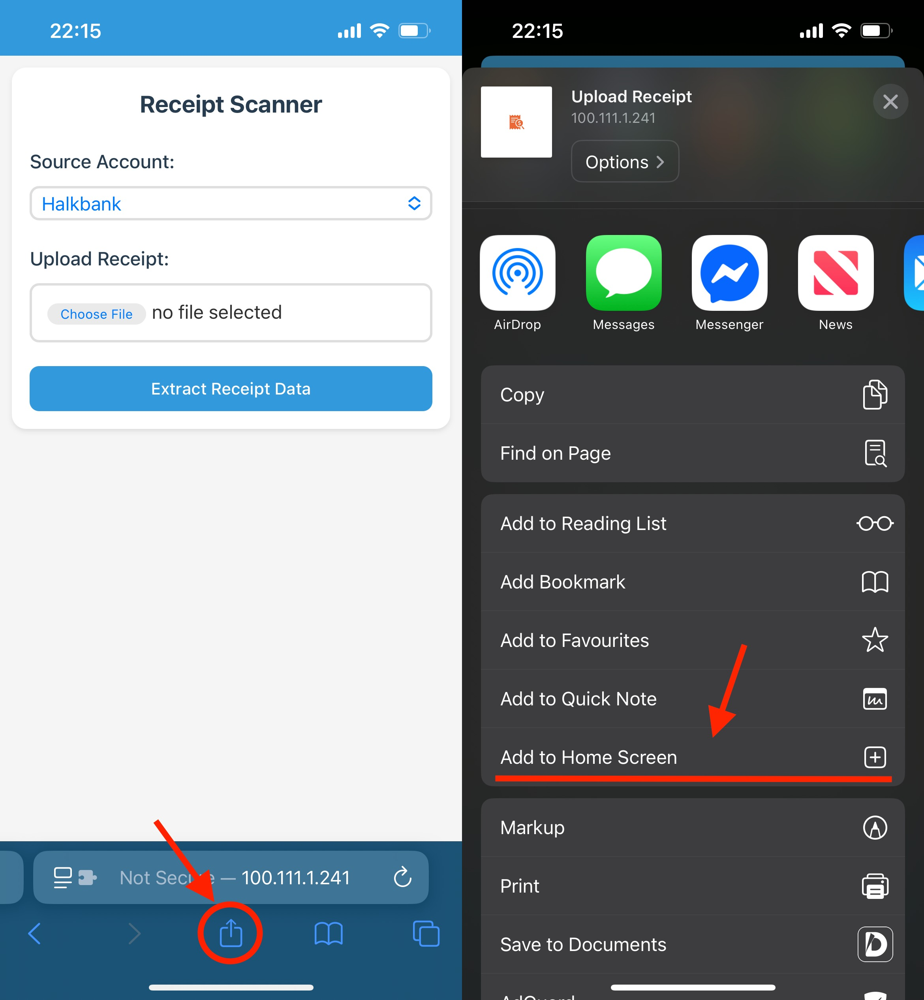

# Receipt Scanner for Firefly III

A web application that allows you to scan receipts and automatically create transactions in Firefly III.

## Demo

Check out the demo video below to see the Receipt Scanner in action:


## Features

- Upload and scan receipts using Google's Gemini AI
- Extract key information: date, amount, store name, category, and budget
- Review and edit extracted data before creating transactions
- Create transactions in Firefly III with a single click
- Mobile-friendly interface for scanning receipts on the go

## Prerequisites

- Docker and Docker Compose
- A Firefly III instance
- A Google AI API key

## Configuration

1. Clone this repository:
   ```
   git clone https://github.com/yourusername/receipt-scanner.git
   cd receipt-scanner
   ```

2. Create a `.env` file based on the `.env.example`:
   ```
   cp .env.example .env
   ```

3. Edit the `.env` file with your configuration:
   ```
   # Firefly III API Configuration
   FIREFLY_III_URL=https://your-firefly-iii-instance.com
   FIREFLY_III_TOKEN=your-personal-access-token

   # Google AI API Configuration
   GOOGLE_AI_API_KEY=your-google-ai-api-key
   ```
   
### Requesting Firefly III Token

   To use this application, you'll need a personal access token for Firefly III. Follow the instructions in the official documentation to generate one: [Firefly III API - Personal Access Tokens](https://docs.firefly-iii.org/how-to/firefly-iii/features/api/#personal-access-tokens)

### Requesting a Gemini API Key
   To use Google's Gemini AI, you'll need an API key. Visit the following URL to request one: [https://aistudio.google.com/apikey](https://aistudio.google.com/apikey)

   You will be asked to enter a credit card for verification purposes, but personal usage will most likely fall within the free tier.

## Deployment

### Using Docker Compose (Recommended)

1. Build and start the application:
   ```
   docker-compose up -d
   ```

2. Access the application at http://localhost:8000

### Manual Deployment

1. Install the required dependencies:
   ```
   pip install -r requirements.txt
   ```

2. Run the application:
   ```
   uvicorn app.app:app --host 0.0.0.0 --port 8000
   ```

## Usage
   1. Open the application in your web browser
   2. Select a source account from the dropdown menu
   3. Use the camera to take a photo of your receipt
   4. Review and edit the extracted data
   5. Click "Create Transaction" to create the transaction in Firefly III

If you're using a phone, consider adding a bookmark of the app to your home screen for easier access.



## Troubleshooting

### Common Issues

- **Image Processing Timeout**: If you receive a timeout error when processing an image, try using a clearer image with better lighting and less glare.
- **Transaction Creation Failed**: If transaction creation fails, check your Firefly III connection and ensure your API token has the necessary permissions.
- **Camera Not Working**: Ensure your browser has permission to access your camera. For mobile devices, you may need to use HTTPS.

## Development

### Project Structure

- `app/` - Application code
  - `app.py` - FastAPI application and routes
  - `firefly.py` - Firefly III API integration
  - `receipt_processing.py` - Receipt data extraction and processing
  - `image_utils.py` - Image processing utilities
  - `models.py` - Data models
  - `templates/` - HTML templates
  - `static/` - Static assets (CSS, JavaScript)


## Contributing

Contributions are welcome! Please feel free to submit a Pull Request.

## License

MIT
